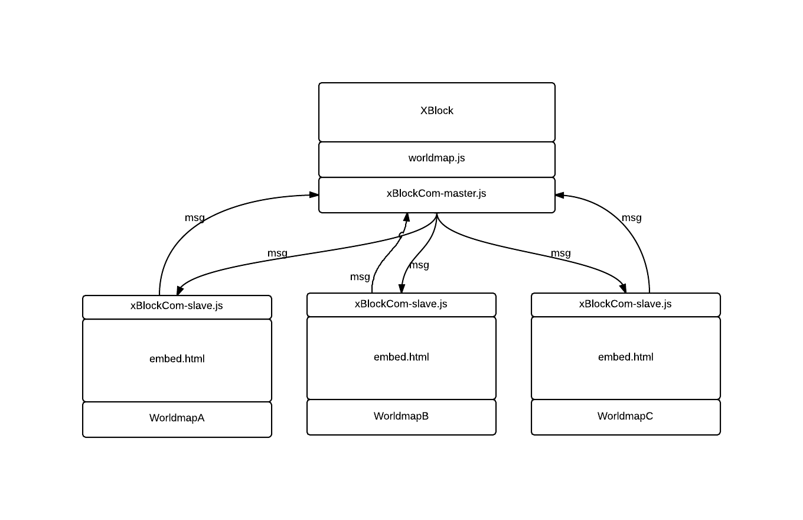

==============================
Worldmap XBlock Adapter Design
==============================
  - Robert Light
    light@alum.mit.edu

The Worldmap XBlock adapter integrates Harvard University's Worldmap_ GIS facility with the edX XBlock_ architecture.
The main piece of "glue" that allows these two disperate systems to talk to one another is the *Messaging* system that allows
the XBlock to send commands to the Worldmap client and receive messages in return.  The javascript files that implement this messaging
are xBlockCom-master.js and xBlockCom-slave.js

This facility is built on top of HTML5's cross-document messaging via Window.postMessage_ capabilities which lets a main page communicate with a page
loaded within an IFrame and vice verse.  This technology is working on all current versions of all major browsers
as documented here_.

The xBlockCom-master.js is loaded by the XBlock-based page which is either loaded via the XBlock workbench, LMS or Studio.
The worldmap itself is loaded in an IFrame within the XBlock's page-space. The xBlockCom-slave.js is loaded by the embed.html mainpage which wraps the worldmap.

There are only 2 restrictions with this architecture:

1. If the master page is running off an *http* server, the slave page (ie: worldmap) must also be served on an *http* server (likewise with https).  This is a restriction imposed by the basic javascript sandbox security rules.
2. The data contained in the message payload must not have pointers to protected resources - like the browser's sandbox resources etc.
3. Since a single edX "page" may host more than one worldmap IFrames, each slave instance must be addressed uniquely.  Hence with the xBlockCom-master.js, all communications require a uniqueId that
distinguishes one slave instance from another (we use the XBlock's unique value for *scope_ids.usage_id* to disambiguate between multiple IFrames.

.. _Worldmap: http://worldmap.harvard.edu/
.. _XBlock: https://xblock.readthedocs.org/en/latest/
.. _Window.postMessage: http://blog.teamtreehouse.com/cross-domain-messaging-with-postmessage
.. _here: http://caniuse.com/#feat=x-doc-messaging

From the point of view of the master, to send a message to a particular slave, you use::

    MESSAGING.getInstance().send(slaveUniqId, new Message(messageType, dataFromMaster));

to setup a function to field messages from a particular slave, you use::

    MESSAGING.getInstance().addHandler(slaveUniqId, messageType, function(msg) {
        alert("the slave said: "+msg.message);
        //generally we use: dataFromSlave = JSON.parse(msg.message) to get to the data.
    });

In the slave, to setup a handler function to field messages of *messageType* from the master, you use::

    MESSAGING.getInstance().registerHandler(messageType, function(msg) {
        dataFromMaster = msg.getMessage();
    });

The slave, of course can send a message at anytime back to the master via::

    MESSAGING.getInstance().send( new Message( messageType, dataFromSlave));

The xBlockCom-master.js and xBlockCom-slave.js are written to be completely divorced from worldmap and can be used in any other
situation where communication must occur between a master page and an embeded page loaded in an IFrame.

embed.html
----------

The embed.html was extended from the original version of embed.html whose job it was to set up the configuration for worldmap and then instantiates it.
It was expanded to include all the setup of the various messaging handlers (discussed above) and then sends a message back to the master
saying "portalReady".  At that point, the master sets the position and zoom level to whatever it was the last time the student viewed this map
and initializes the visibility of the layers to their previous (or initial) values.

All message passing between master and slave is asyncronous, the calls return immediately and it is the responsibility of the slave to return
enough information to the master to understand what the slave is responding to.

TODO: we need a way to start everything out with particular layers visible.

