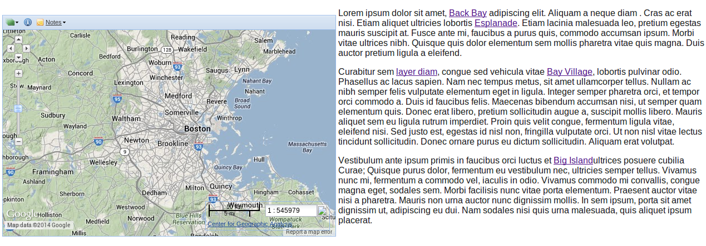
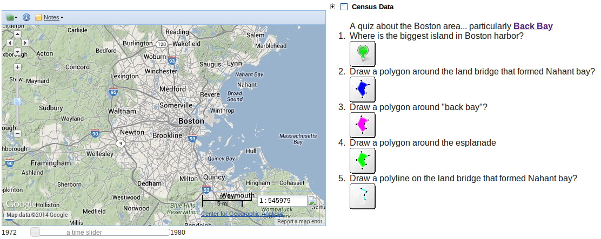

=======================
Worldmap XBlock Adapter
=======================

XBlock is a component architecture for building courseware.  An XBlock is similar
in structure to web applications and fills a similar niche.  The Worldmap XBlock integration
attempts to seamlessly interface Harvard's Worldmap_ into the EdX XBlock architecture.  We provide in this release
a ``<worldmap-quiz>`` and a ``<worldmap-expository>`` tag that
allow you to insert interactive worldmap items in your EdX courseware.  The quiz functionality allow you to ask
map-based questions and allow the student to answer them by clicking on map locations, drawing polygons or polylines
on the map etc.  The expository tag allows you to intersperse 'live-map' tags in your html text.  These tags will
allow the student (by clicking the link) to turn on layers, view polygons, polylines, and marked map locations on an
associated map.

We also allow the course creator the ability to create hierarchical layer controls to turn on/off layers using
layer names that may be more appropriate to the course content than the layer name stored within the worldmap.
The hierarchical layer control also allows you to turn on/off groups of layers with a single click.

Parameters can also be associated with layers - these parameters might be 'year', 'income range', 'age' or any
other numerical property.  Sliders can then be specified to allow the student to control these layers by
interactively moving a slider control to illuminate each layer based on the parameter value.

.. _Worldmap: http://worldmap.harvard.edu/

<worldmap-expository> tag
-------------------------
The expository view is the main "teaching" view which pairs a bunch of tagged html with a worldmap view.  When the
student clicks on the links, the map will scroll and zoom and either a layer, a polygon, polyline or a marker will
be displayed.

The worldmap-expository tag has an "explanation" to wrap the main html of the discussion concerning the enclosed worldmap.
It also has zero or more pieces of geometry to use within the explanation as clickable tags and then finally, the worldmap
tag itself::

    <worldmap-expository>
        <explanation>
              Lorem ipsum dolor sit amet, <a href='#' onclick='return highlight("id1", 0, -2)'>polygon</a> adipiscing
              
Curabitur sem <a href='#' onclick='return highlightLayer("OpenLayers_Layer_WMS_124",5000, -2)'>layer of interest</a>, congue sed vehicula vitae
        </explanation>
        <polygon id='id1'>
             <point lon=".." lat=".."/>
             <point lon=".." lat=".."/>
             <point lon=".." lat=".."/>
             ....
        </polygon>
        .... more polygons, polylines, points
        <worldmap href='...' debug='true' width='600' height='400' baseLayer='OpenLayers_Layer_Google_116'/>
    </worldmap-expository>

<worldmap-quiz> tag
-------------------
For assessments, we wanted to give the ability to ask questions that require the student to go to the map and point at
something, draw a polygon or polyline as their answer.  Each answer is subjected to a series of geometric "constraints"
that determine whether or not the student's answer is correct.  Each correct constraint gives a predefined amount of
``credit`` to the overall score for the question.  If the student answers the question incorrectly a predefined number of times,
a hint will be displayed showing him all the constraints that were not satisfied.

The worldmap-quiz tag has an "explanation" to wrap the main question text, zero or more pieces of geometry (polygon, polyline, point)
to use within your explanation and then finally, one or more <answer> tags to represent the answers that you are requesting
the student to give::

    <worldmap-quiz>
        <explanation>
             html for basic question including links <a href='#' onclick='return highlight("id1", 5000, -2)'>show me a polygon</a>
        </explanation>

        <!-- polygons, polylines and points referred to in the explanation tag above -->
        <polygon id='id1'>
             <point lon=".." lat=".."/>
             <point lon=".." lat=".."/>
             ...
        </polygon>
        ...more points, polylines and polygons...

        <!-- one or more answers needed from student -->
        <answer id='uniqId1' color='00FF00' type='point' hintAfterAttempt='3'>
           <!-- requesting a point click -->
           <explanation>
              Where is the biggest island in Boston harbor?
           </explanation>
           <constraints>  <!-- one or more constraints to evaluate answer -->
              <matches percentOfGrade="25" padding='1000'>
                  <point lon="-70.9657058456866" lat="42.32011232390349"/>
                  <explanation>
                     <B> Look at boston harbor - pick the biggest island </B>
                  </explanation>
              </matches>
           </constraints>
        </answer>
        <worldmap ....
        </worldmap>
    </worldmap-quiz>

answers & constraints
---------------------

Each user answer is evaluated based on a set of one or more geometric constraints.  The user's answer might be a point,
a polygon or a polyline based on the *type* attribute of the <answer> tag (acceptable values: polygon | polyline | point)

 * matches - does the drawn polygon or polyline match the correct geometry?
 * inside - is drawn polygon, polyline or point inside the constraint's polygon?
 * includes - does drawn polygon include the constraint's polygon, polyline or point?
 * excludes - does drawn polygon exclude the constraint's polygon, polyline or point?

The concept of "matches" involves an attribute *percentMatch* which determines how much overlap is required in order to be considered "matched".
Generally, a good value is between 55-75.

For all constraints, the attribute *percentOfGrade* defines how much of the grade is dependent on this constraint
being satisfied. (Note: the sum of all the *percentOfGrades* do not have have to add up to 100)

For matches and includes constraints, the *padding* attribute allows some "slop" in the calculation enlarging the correct
geometry by *padding* meters in all directions.  *padding* also controls how fuzzy the hint geometry is when displaying
the hint on the map.

The <answer> tag has an attribute for *color* to define what color to use when drawing on the map and an attribute *hintAfterAttempt* which
if set to 0, no hint will be displayed no matter how many incorrect attempts were made.  If *hintAfterAttempt* > 0 a hint will be displayed after *hintAfterDisplay* number of
failures.  The <explanation> tag inside the constraint is used to specify what is displayed as part of the *hint*.

The *includes* constraint has a special need.  It has an attribute *maxAreaFactor* which is a number > 1 and is needed because
with out it, the student could draw a polygon around the entire hemisphere and thereby satisfy the constraint.  Hence, if the
constraint specifies maxAreaFactor=2 it means the user's answer can't be any bigger than *2x* the area of the constraint's polygon, padded point or padded polyline.

worldmap tag
------------

The <worldmap> tag encompasses everything which controls the display of a worldmap frame.

 Attributes:
     href:
       the url of the worldmap embed webpage.  embed.html contains all the interfacing code needed to connect the worldmap site
       to the xblock infrastructure.
     debug:
       if *true* a little text area is displayed to give the course author information such as worldmap layerIds, polygon, polyline and point xml
       if *false* no debug area is displayed.

     width:
       width of window (in pixels)

     height:
       height of window (in pixels)

     baseLayer:
       which layerId should be used for the base layer.

layer tag:

The worldmap tag optionally can contain a <layers>, <group-control> or <sliders> tag.  The <layers> group tag defines one
or more <layer> tag which associates one or more parameters to a layerId.  For example::

  <layer id="a_layer_id">
     <param name="Year" min="1973" max="1977"/>
     <param name="Income" value="1000" />
  </layer>

The above example associates a layer range "Year" and a parameter "Income" with a particular layer: "a_layer_id".  Later
on, we will explore the <slider> tag which will allow "a_layer_id" to be made visible/hidden based on the value of a
slider which is controlling parameter "Year" or "Income".

slider tag:

A <slider> tag creates a slider which controls the visibility of a set of layers which are associated with a particular
parameter value.  For example::

  <slider id="timeSlider" title="a time slider" param="Year" min="1972" max="1980" increment="0.2" position="bottom">
     <help>
         <B>This is some html</B> 
         <i>you can use to create help info for using or interpreting the slider</i>
         <ul>
            <li>You can explain what it does</li>
            <li>How to interpret things</li>
            <li>What other things you might be able to do</li>
         </ul>
     </help>
  </slider>

The *param* attribute is the linkage with the layer's <param> tags (described above).  Note that if any of the layers use
a single valued parameter value, then you really should make sure that the increment will allow the slider to land (and stick)
on a single value - otherwise, the layer tends to flash on-and-off and it's hard to drop the slider exactly at the single value point.

The attribute: *position* can have values of left, right, top, bottom to indicate where the slider will appear relative to the worldmap frame.
If there are more than one slider in a particular location, they will stack.

group-control tag:

One of the problems with using worldmap in its "native" state is that the layer names are defined by the map creator and are possibly not
optimal for a particular course segment.  In addition, you may wish to have the layer name appear in another language.  The other limitation
with using worldmap in its "native" state is that all the layers are visible in the menu to be manipulated - thus defocussing the student
from the few layers that are important for a particular segment of the curricula.

The group-control was created to address these shortcomings.  The tags displayed can be in any language or character set and
organized in any manner.  The group tags are tri-state checkboxes which control all their children when clicked.

The group-control as well as the layer-control can have an attribute *visibility* - if the group-control is visible, and its children
layer-controls have visiblity=false, then the layers won't be displayed in the group - but if the group checkbox is set, then all child layer-controls
will be set/unset as a group regardless of the visibility attribute of the layer-control.  If, however you set the visibility of
a group-control to 'false' - the group-control won't be shown and the children of that control will not be visible or controllable via the upper
levels of the hierarchy.
